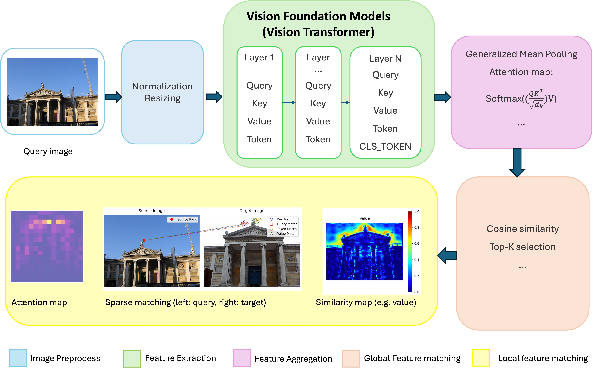
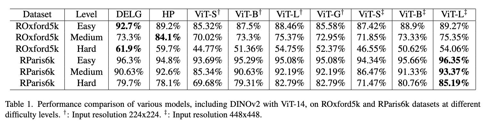
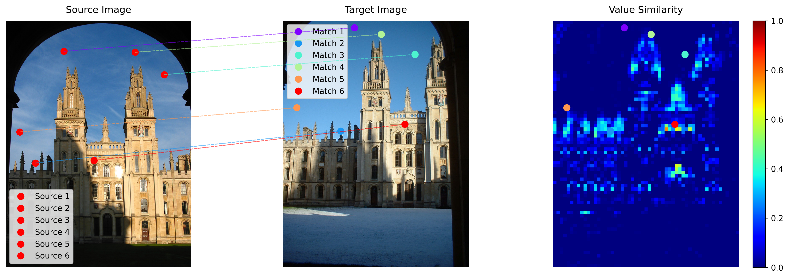
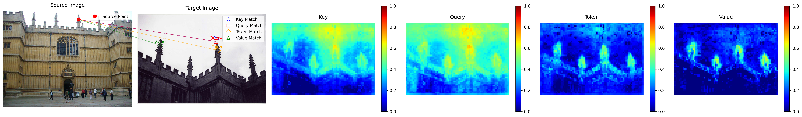
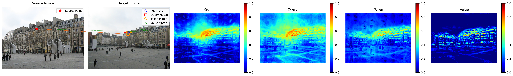
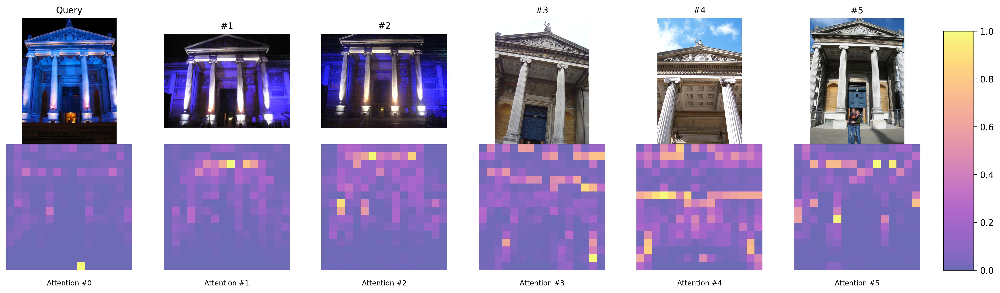
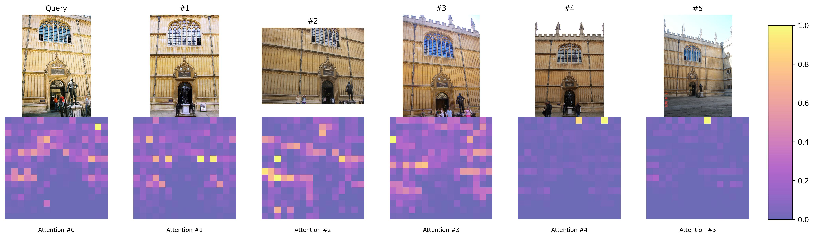
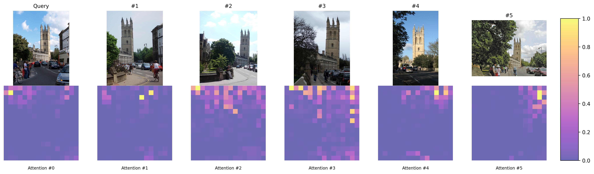

# AnyRetrieval: Enhancing Zero-Shot Image Retrieval with Vision Foundation Models


AnyRetrieval leverages state-of-the-art Vision Foundation Models, specifically DINOv2, to advance zero-shot image retrieval tasks. This repository evaluates the performance of DINOv2 on the ROxford5k and RParis6k datasets, demonstrating its superiority in various retrieval scenarios without relying on labeled data.



## Table of Contents

- [Features](#features)
- [Installation](#installation)
- [Data Preparation](#data-preparation)
- [Usage](#usage)
  - [Cached Features (Optional)](#cached-features-optional)
  - [Zero-Shot Evaluation](#zero-shot-evaluation)
- [Results](#results)
  - [Evaluation Results on ROxford5k and RParis6k](#evaluation-results-on-roxford5k-and-rparis6k)
  - [Sparse Matching Visualization](#sparse-matching-visualization)
  - [Similarity Map Visualization](#similarity-map-visualization)
- [Acknowledgements](#acknowledgements)
- [License](#license)

## Features

- **State-of-the-Art Performance:** DINOv2 models achieve top-tier results on ROxford5k and RParis6k datasets, excelling in high-quality and moderate-difficulty retrieval tasks.
- **Flexible Configurations:** Supports multiple input resolutions (224x224 and 448x448) and scalable model sizes (from ViTS14 to ViTG14), balancing computational efficiency and accuracy.
- **Competitive Edge:** Outperforms traditional supervised models like DELG in easy scenarios and remains competitive in challenging retrieval tasks.
- **Zero-Shot Capabilities:** Utilizes self-supervised learning to extract robust and generalizable features without labeled data.

## Installation

Ensure you have [Conda](https://docs.conda.io/en/latest/) installed. Then, execute the following commands:

```bash
# Create a new Conda environment (optional but recommended)
conda create -n anyretrieval python=3.8
conda activate anyretrieval

# Install PyTorch and torchvision
conda install --yes -c pytorch pytorch=1.7.1 torchvision cudatoolkit=11.0

# Install additional dependencies
pip install ftfy regex tqdm

# Install CLIP from GitHub
pip install git+https://github.com/openai/CLIP.git
```

> **Note:** Replace `cudatoolkit=11.0` with the appropriate CUDA version for your system or omit it if using a CPU.

## Data Preparation

Datasets are automatically downloaded when executing the evaluation scripts. No manual data preparation is required.

## Usage

### Cached Features (Optional)

For rapid evaluation and result visualization, you can use pre-extracted cached features:

- **Database Features:** `data/roxford5k_db_features.pkl`
- **Query Features:** `data/roxford5k_query_features.pkl`

**Evaluate Cached Features:**

```bash
python evaluate_dinov2_attention.py
```

This command evaluates image retrieval performance using DINOv2 models with fused attention.

### Zero-Shot Evaluation

Run the following scripts to evaluate image retrieval performance using different model configurations:

```bash
# Evaluate CLIP models
python evaluate_clip_cls_token.py

# Evaluate DINOv2 models with classification tokens
python evaluate_dinov2_cls_token.py

# Evaluate DINOv2 models with QKV
python evaluate_dinov2_qkv.py

# Evaluate DINOv2 models with QKV and GEM
python evaluate_dinov2_qkv_gem.py

# Evaluate DINOv2 models with fused attention
python evaluate_dinov2_attention.py
```

## Results

### Evaluation Results on ROxford5k and RParis6k



### Sparse Matching Visualization



### Similarity Map Visualization






### Visualization of Attention Maps with top-k Similarity Scores





## Acknowledgements

We extend our gratitude to the authors of the following repositories for their invaluable contributions:

- [Revisitop](https://github.com/filipradenovic/revisitop)
- [AnyLoc](https://github.com/AnyLoc/AnyLoc)
- [DINOv2 PCA Visualization](https://github.com/JunukCha/DINOv2_pca_visualization)

## License

This project is licensed under the MIT License. See the [LICENSE](LICENSE) file for details.

---

Feel free to contribute by opening issues or submitting pull requests. For major changes, please open an issue first to discuss what you would like to change.
