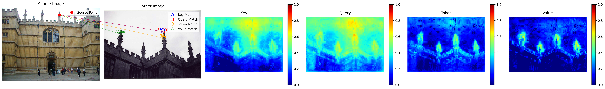

# AnyRetrival: Enhancing Zero-shot Image Retrieval with Vision Foundation Models


This repository evaluates the performance of DINOv2 models on image retrieval tasks using the ROxford5k and RParis6k datasets. DINOv2 models leverage self-supervised learning to extract robust and generalizable features without relying on labeled data. The results show that DINOv2 achieves state-of-the-art performance in various retrieval scenarios, particularly excelling in high-quality and moderate-difficulty tasks. By supporting flexible input resolutions (224x224 and 448x448) and scalable model sizes (from vits14 to vitg14), DINOv2 adapts effectively to diverse use cases, offering a balance between computational efficiency and retrieval accuracy. Notably, DINOv2 surpasses traditional supervised models like DELG in easy scenarios while demonstrating competitive performance in hard retrieval challenges.


## Usage
### Installation
To install the required packages, run the following command:
```bash
conda install --yes -c pytorch pytorch=1.7.1 torchvision cudatoolkit=11.0
pip install ftfy regex tqdm
pip install git+https://github.com/openai/CLIP.git
```
Cudatoolkit=11.0 can be replaced with the appropriate CUDA version on your machine or omitted if you are using a CPU.

### Data Preparation
Dataset will be downloaded automatically when running the the eval*.py script.

### Zeor-Shot evaluation
```bash
python evaluate_clip_cls_token.py # Evaluate the image retrieval performance on CLIP models
python evaluate_dinov2_cls_token.py # Evaluate the image retrieval performance on DINOv2 models
python evaluate_dinov2_qkv.py # Evaluate the image retrieval performance on DINOv2 models with QKV
python evaluate_dinov2_qkv_gem.py # Evaluate the image retrieval performance on DINOv2 models with QKV and GEM
```
### Evaluation results on ROxford5k and RParis6k 


### Sparse matching visualization


### Similarity map visualization on Query, Key, Value and Token

## Acknowledgements
We thank the authors of the following repositories for their contributions to this project:
- [Revisitop](https://github.com/filipradenovic/revisitop) 
- [AnyLoc](https://github.com/AnyLoc/AnyLoc)
